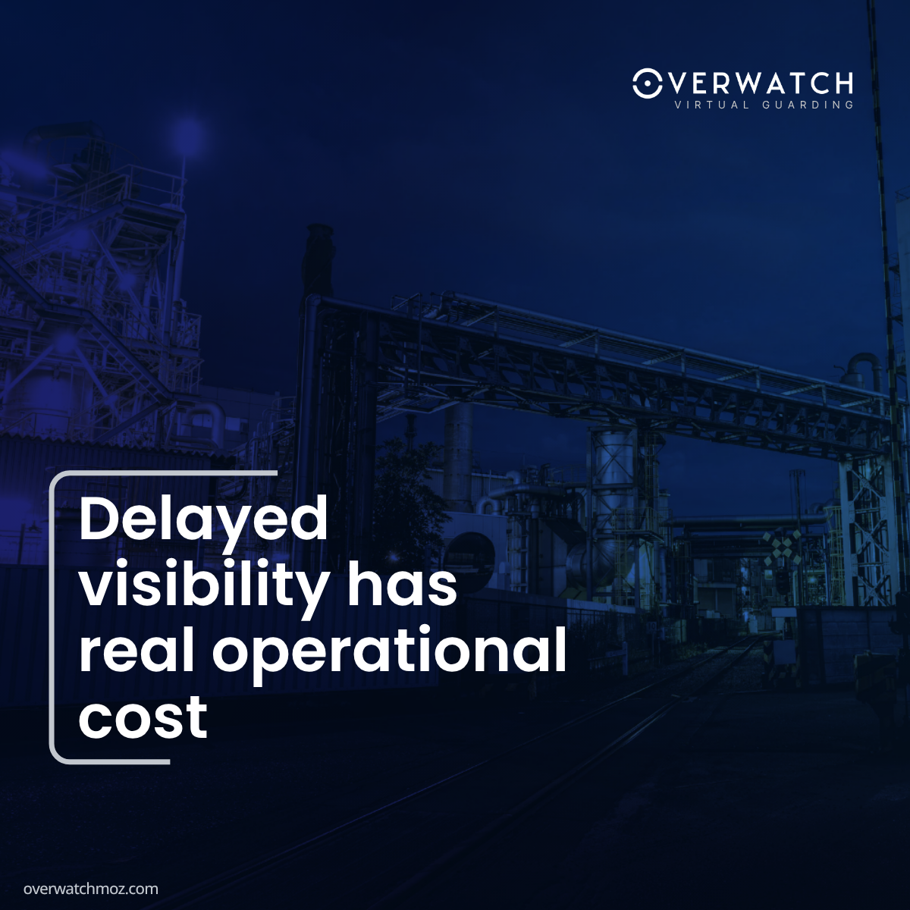

# COS 106 - Introduction to Web Technologies
## Practical Term Project Submission

**Name:** Ebube Junior Michael  
**Email:** e.michael7478@miva.edu.ng  
**Department:** Cybersecurity  
**Matriculation Number:** 2025/A/CYB/0612  

**Hosted Website Link:** [Your Hosted Link Here]  
**GitHub Repository Link:** [Your Repo Link Here]  

---

## Source Code

### index.html
`html
<!DOCTYPE html>
<html lang="en">
<head>
  <meta charset="UTF-8">
  <meta name="viewport" content="width=device-width, initial-scale=1.0">
  <meta name="description" content="Ebube Junior Michael — Cybersecurity Student, Web Developer and Creative Digital Professional at Miva Open University.">
  <title>Ebube Junior Michael | Portfolio</title>
  
  <link rel="stylesheet" href="css/style.css">
</head>
<body class="home-page">

  <!-- ===== NAVIGATION ===== -->
  <nav class="navbar" id="navbar">
    

      <a href="index.html" class="logo">EJM.</a>
      <button class="mobile-menu-btn" id="menu-btn" aria-label="Toggle menu">&#9776;</button>
      

        <a href="index.html" class="active">Home</a>
        <a href="about.html">About</a>
        <a href="projects.html">Projects</a>
        <a href="planner.html">Planner</a>
        <a href="contact.html">Contact</a>
      

    

  </nav>

  <!-- ===== HERO ===== -->
  <main>
    <section class="hero">
      <canvas id="hero-canvas" aria-hidden="true"></canvas>
      

        

          <!-- Text -->
          <!-- Text -->
          

            

               Welcome to my workspace 👋
            

            <h1 class="hero-title animate delay-1">Ebube Junior Michael</h1>
            

              &gt;_ Cybersecurity Student & Creative Developer
            

            

              

                I'm passionate about security operations, web development, and digital media. I love combining technical logic with creative design to build secure, beautiful, and impactful digital experiences. Take a look around to explore my work!
              

            

            

              <a href="projects.html" class="btn btn-primary">
                View Projects
                <svg xmlns="http://www.w3.org/2000/svg" width="16" height="16" viewBox="0 0 24 24" fill="none" stroke="currentColor" stroke-width="2" stroke-linecap="round" stroke-linejoin="round" style="margin-left:8px"><line x1="5" y1="12" x2="19" y2="12"></line><polyline points="12 5 19 12 12 19"></polyline></svg>
              </a>
              <a href="contact.html" class="btn btn-outline">Get in Touch</a>
            

          

          <!-- Photo -->
          

            

              
            

          

        

        <!-- Stats bar -->
        

          

            
3+

            
Live Projects

          

          

            
12+

            
Technical Skills

          

          

            
Jan 2026

            
Enrolled

          

          

            
CYB

            
Department

          

        

      

    </section>
  </main>

  <!-- ===== FOOTER ===== -->
  <footer>
    

      
&copy; 2026 Ebube Junior Michael &mdash; Miva Open University, Cybersecurity &mdash; 2025/A/CYB/0612

    

  </footer>

  
  
</body>
</html>

`

### about.html
`html
<!DOCTYPE html>
<html lang="en">
<head>
  <meta charset="UTF-8">
  <meta name="viewport" content="width=device-width, initial-scale=1.0">
  <meta name="description" content="Learn about Ebube Junior Michael — educational background, career aspirations, technical skills and interests.">
  <title>About Me | Ebube Junior Michael</title>
  <link rel="stylesheet" href="css/style.css">
  
</head>
<body>

  <!-- ===== NAVIGATION ===== -->
  <nav class="navbar" id="navbar">
    

      <a href="index.html" class="logo">EJM.</a>
      <button class="mobile-menu-btn" id="menu-btn" aria-label="Toggle menu">&#9776;</button>
      

        <a href="index.html">Home</a>
        <a href="about.html" class="active">About</a>
        <a href="projects.html">Projects</a>
        <a href="planner.html">Planner</a>
        <a href="contact.html">Contact</a>
      

    

  </nav>

  <main>

    <!-- ===== ABOUT HERO ===== -->
    <section class="about-hero">
      

        

          

            
About Me

            <h1 class="about-quote">
              Building secure systems. 
              Crafting digital experiences. 
              Protecting the web.
            </h1>
          

          

            

              I am a cybersecurity student, web developer, and creative digital professional with a strong passion for security operations, penetration testing, and digital innovation. My journey combines technical expertise in cybersecurity with creativity in graphic design and video editing.
            

            

              I am dedicated to building secure digital systems, identifying vulnerabilities, and creating impactful visual experiences that solve real-world problems.
            

            

              Cybersecurity
              Web Development
              Digital Media
            

          

        

      

    </section>

    <!-- ===== ABOUT BODY ===== -->
    

      

        <!-- Row 1: Education + Career -->
        

          <!-- Education -->
          

            
Education

            <h2 style="font-size: var(--text-2xl); margin-bottom: var(--space-6);">Academic Background</h2>

            

              

                

                  

                  

                

                

                  
January 2026 &mdash; Present

                  <h3 class="timeline-title" style="font-size: var(--text-lg); margin-bottom: 4px;">B.Sc. Cybersecurity</h3>
                  
Miva Open University

                  

                    In Progress
                  

                  

                    Practical experience in web development, digital branding, and cybersecurity fundamentals acquired alongside the degree programme.
                  

                

              

            

            <!-- Info row -->
            <table class="edu-table" style="margin-top: var(--space-2);">
              <thead>
                <tr>
                  <th>Detail</th>
                  <th>Info</th>
                </tr>
              </thead>
              <tbody>
                <tr>
                  <td>Matriculation Number</td>
                  <td>2025/A/CYB/0612</td>
                </tr>
                <tr>
                  <td>Department</td>
                  <td>Cybersecurity</td>
                </tr>
                <tr>
                  <td>Email</td>
                  <td>e.michael7478@miva.edu.ng</td>
                </tr>
              </tbody>
            </table>
          

          <!-- Career -->
          

            
Career Goal

            <h2 style="font-size: var(--text-2xl); margin-bottom: var(--space-6);">Aspirations</h2>

            

              

                

                  <!-- Shield check icon -->
                  <svg viewBox="0 0 24 24"><path d="M12 22s8-4 8-10V5l-8-3-8 3v7c0 6 8 10 8 10z"/></svg>
                

                

                  
SOC Analyst

                  
Security Operations

                

              

              

                Monitoring, detecting, and responding to cybersecurity threats in real time to protect organisational infrastructure.
              

            

            

              

                

                  <!-- Bug/scan icon -->
                  <svg viewBox="0 0 24 24"><circle cx="12" cy="12" r="3"/><path d="M12 2v4M12 18v4M4.93 4.93l2.83 2.83M16.24 16.24l2.83 2.83M2 12h4M18 12h4M4.93 19.07l2.83-2.83M16.24 7.76l2.83-2.83"/></svg>
                

                

                  
Penetration Tester

                  
Ethical Hacking

                

              

              

                Conducting authorised simulated attacks on systems to expose vulnerabilities before malicious actors can exploit them.
              

            

          

        

        

        <!-- Row 2: Skills -->
        

          
Skills

          <h2 style="font-size: var(--text-2xl); margin-bottom: var(--space-8);">Technical Proficiencies</h2>

          

            

              <!-- Web Development group -->
              

                
Web Development

                

                  
                    <svg viewBox="0 0 24 24" stroke="currentColor" fill="none" stroke-width="2" stroke-linecap="round" stroke-linejoin="round"><polyline points="16 18 22 12 16 6"/><polyline points="8 6 2 12 8 18"/></svg>
                    HTML &amp; CSS
                  
                  
                    <svg viewBox="0 0 24 24" stroke="currentColor" fill="none" stroke-width="2" stroke-linecap="round" stroke-linejoin="round"><polyline points="16 18 22 12 16 6"/><polyline points="8 6 2 12 8 18"/></svg>
                    JavaScript
                  
                  
                    <svg viewBox="0 0 24 24" stroke="currentColor" fill="none" stroke-width="2" stroke-linecap="round" stroke-linejoin="round"><rect x="3" y="3" width="18" height="18" rx="2"/><path d="M3 9h18M9 21V9"/></svg>
                    Website Development
                  
                  
                    <svg viewBox="0 0 24 24" stroke="currentColor" fill="none" stroke-width="2" stroke-linecap="round" stroke-linejoin="round"><circle cx="12" cy="12" r="10"/><path d="M2 12h20M12 2a15 15 0 0 1 0 20M12 2a15 15 0 0 0 0 20"/></svg>
                    UI / UX Design
                  
                  
                    <svg viewBox="0 0 24 24" stroke="currentColor" fill="none" stroke-width="2" stroke-linecap="round" stroke-linejoin="round"><path d="M13 2L3 14h9l-1 8 10-12h-9l1-8z"/></svg>
                    Vibe Coding
                  
                

              

              <!-- Creative group -->
              

                
Creative & Design

                

                  
                    <svg viewBox="0 0 24 24" stroke="currentColor" fill="none" stroke-width="2" stroke-linecap="round" stroke-linejoin="round"><circle cx="12" cy="12" r="10"/><circle cx="12" cy="12" r="3"/></svg>
                    Graphic Design
                  
                  
                    <svg viewBox="0 0 24 24" stroke="currentColor" fill="none" stroke-width="2" stroke-linecap="round" stroke-linejoin="round"><polygon points="23 7 16 12 23 17 23 7"/><rect x="1" y="5" width="15" height="14" rx="2"/></svg>
                    Video Editing
                  
                  
                    <svg viewBox="0 0 24 24" stroke="currentColor" fill="none" stroke-width="2" stroke-linecap="round" stroke-linejoin="round"><path d="M20.84 4.61a5.5 5.5 0 0 0-7.78 0L12 5.67l-1.06-1.06a5.5 5.5 0 0 0-7.78 7.78l1.06 1.06L12 21.23l7.78-7.78 1.06-1.06a5.5 5.5 0 0 0 0-7.78z"/></svg>
                    Branding
                  
                  
                    <svg viewBox="0 0 24 24" stroke="currentColor" fill="none" stroke-width="2" stroke-linecap="round" stroke-linejoin="round"><path d="M11 4H4a2 2 0 0 0-2 2v14a2 2 0 0 0 2 2h14a2 2 0 0 0 2-2v-7"/><path d="M18.5 2.5a2.121 2.121 0 0 1 3 3L12 15l-4 1 1-4 9.5-9.5z"/></svg>
                    Content Creation
                  
                

              

            

            

              <!-- Cybersecurity group -->
              

                
Cybersecurity

                

                  
                    <svg viewBox="0 0 24 24" stroke="currentColor" fill="none" stroke-width="2" stroke-linecap="round" stroke-linejoin="round"><path d="M12 22s8-4 8-10V5l-8-3-8 3v7c0 6 8 10 8 10z"/></svg>
                    Cybersecurity Fundamentals
                  
                  
                    <svg viewBox="0 0 24 24" stroke="currentColor" fill="none" stroke-width="2" stroke-linecap="round" stroke-linejoin="round"><circle cx="11" cy="11" r="8"/><line x1="21" y1="21" x2="16.65" y2="16.65"/></svg>
                    Vulnerability Assessment
                  
                  
                    <svg viewBox="0 0 24 24" stroke="currentColor" fill="none" stroke-width="2" stroke-linecap="round" stroke-linejoin="round"><circle cx="12" cy="12" r="10"/><line x1="12" y1="8" x2="12" y2="12"/><line x1="12" y1="16" x2="12.01" y2="16"/></svg>
                    OSINT
                  
                

              

              <!-- Aspiration note -->
              

                
Currently Learning

                <ul style="list-style: disc; padding-left: var(--space-4);">
                  <li style="font-size: var(--text-sm); color: var(--color-text-2); margin-bottom: var(--space-2);">Network forensics &amp; incident response</li>
                  <li style="font-size: var(--text-sm); color: var(--color-text-2); margin-bottom: var(--space-2);">Advanced penetration testing techniques</li>
                  <li style="font-size: var(--text-sm); color: var(--color-text-2);">SOC operations &amp; threat intelligence</li>
                </ul>
              

            

          

        

        

        <!-- Row 3: Interests -->
        

          
Interests

          <h2 style="font-size: var(--text-2xl); margin-bottom: var(--space-3);">Hobbies &amp; Passions</h2>
          
Outside of academics, I am driven by a curiosity that spans both digital security and creative expression.

          <ol class="interests-grid">

            <li class="interest-card">
              

                <!-- Terminal / hacking icon -->
                <svg viewBox="0 0 24 24"><polyline points="4 17 10 11 4 5"/><line x1="12" y1="19" x2="20" y2="19"/></svg>
              

              Ethical Hacking
            </li>

            <li class="interest-card">
              

                <!-- Shield magnifier -->
                <svg viewBox="0 0 24 24"><path d="M12 22s8-4 8-10V5l-8-3-8 3v7c0 6 8 10 8 10z"/><circle cx="12" cy="11" r="2"/></svg>
              

              Cybersecurity Research
            </li>

            <li class="interest-card">
              

                <!-- Code icon -->
                <svg viewBox="0 0 24 24"><polyline points="16 18 22 12 16 6"/><polyline points="8 6 2 12 8 18"/></svg>
              

              Web Development
            </li>

            <li class="interest-card">
              

                <!-- Layers / design icon -->
                <svg viewBox="0 0 24 24"><polygon points="12 2 2 7 12 12 22 7 12 2"/><polyline points="2 17 12 22 22 17"/><polyline points="2 12 12 17 22 12"/></svg>
              

              Graphic Design
            </li>

            <li class="interest-card">
              

                <!-- Film icon -->
                <svg viewBox="0 0 24 24"><rect x="2" y="2" width="20" height="20" rx="2.18"/><line x1="7" y1="2" x2="7" y2="22"/><line x1="17" y1="2" x2="17" y2="22"/><line x1="2" y1="12" x2="22" y2="12"/><line x1="2" y1="7" x2="7" y2="7"/><line x1="2" y1="17" x2="7" y2="17"/><line x1="17" y1="17" x2="22" y2="17"/><line x1="17" y1="7" x2="22" y2="7"/></svg>
              

              Video Editing
            </li>

            <li class="interest-card">
              

                <!-- CPU / tech exploration -->
                <svg viewBox="0 0 24 24"><rect x="4" y="4" width="16" height="16" rx="2"/><rect x="9" y="9" width="6" height="6"/><line x1="9" y1="1" x2="9" y2="4"/><line x1="15" y1="1" x2="15" y2="4"/><line x1="9" y1="20" x2="9" y2="23"/><line x1="15" y1="20" x2="15" y2="23"/><line x1="20" y1="9" x2="23" y2="9"/><line x1="20" y1="14" x2="23" y2="14"/><line x1="1" y1="9" x2="4" y2="9"/><line x1="1" y1="14" x2="4" y2="14"/></svg>
              

              Technology Exploration
            </li>

            <li class="interest-card">
              

                <!-- Gamepad icon -->
                <svg viewBox="0 0 24 24"><line x1="6" y1="12" x2="10" y2="12"/><line x1="8" y1="10" x2="8" y2="14"/><line x1="15" y1="13" x2="15.01" y2="13"/><line x1="18" y1="11" x2="18.01" y2="11"/><rect x="2" y="6" width="20" height="12" rx="5"/></svg>
              

              Gaming
            </li>

            <li class="interest-card">
              

                <!-- Wrench / tools icon -->
                <svg viewBox="0 0 24 24"><path d="M14.7 6.3a1 1 0 0 0 0 1.4l1.6 1.6a1 1 0 0 0 1.4 0l3.77-3.77a6 6 0 0 1-7.94 7.94l-6.91 6.91a2.12 2.12 0 0 1-3-3l6.91-6.91a6 6 0 0 1 7.94-7.94l-3.76 3.76z"/></svg>
              

              Security Tools
            </li>

          </ol>
        

      

    

  </main>

  <!-- ===== FOOTER ===== -->
  <footer>
    

      
&copy; 2026 Ebube Junior Michael &mdash; Miva Open University, Cybersecurity &mdash; 2025/A/CYB/0612

    

  </footer>

  
</body>
</html>

`

### projects.html
`html
<!DOCTYPE html>
<html lang="en">
<head>
  <meta charset="UTF-8">
  <meta name="viewport" content="width=device-width, initial-scale=1.0">
  <meta name="description" content="Projects by Ebube Junior Michael — Tales and Treasures, Lumina Literacy, Overwatch, and video editing work.">
  <title>Projects | Ebube Junior Michael</title>
  <link rel="stylesheet" href="css/style.css">
  
</head>
<body>

  <!-- ===== NAVIGATION ===== -->
  <nav class="navbar" id="navbar">
    

      <a href="index.html" class="logo">EJM.</a>
      <button class="mobile-menu-btn" id="menu-btn" aria-label="Toggle menu">&#9776;</button>
      

        <a href="index.html">Home</a>
        <a href="about.html">About</a>
        <a href="projects.html" class="active">Projects</a>
        <a href="planner.html">Planner</a>
        <a href="contact.html">Contact</a>
      

    

  </nav>

  <!-- ===== PROJECTS ===== -->
  <main>
    <section class="section" style="padding-top: calc(var(--space-20) + 64px);">
      

        <!-- Header -->
        
Portfolio

        <h1 class="animate delay-1" style="font-size: var(--text-4xl); margin-bottom: var(--space-4);">Selected Projects</h1>
        
A selection of recent work across web development, AI-powered security, and digital media production.

        <!-- ===== FEATURED PROJECT CARDS ===== -->
        

          <!-- Project 1: Tales and Treasures -->
          <article class="featured-card">
            

              
            

            

              

                Literacy
                Community
                Nigeria
              

              <h3 style="font-size:var(--text-xl); margin-bottom:var(--space-3);">Tales and Treasures</h3>
              

                A literacy-focused initiative dedicated to promoting reading culture among children and communities in Nigeria. The project organises book drives, reading programs, and literacy campaigns aimed at improving access to books and encouraging lifelong learning — using storytelling as a powerful tool for education, creativity, and community transformation.
              

              

                <code style="font-size:var(--text-xs); color:var(--color-text-3);">talesandtreasures.com.ng</code>
                <a href="https://talesandtreasures.com.ng" target="_blank" rel="noopener" class="btn btn-primary" style="padding:8px 18px; font-size:var(--text-xs);">Visit Live Site &rarr;</a>
              

            

          </article>

          <!-- Project 2: Lumina Literacy -->
          <article class="featured-card">
            

              
            

            

              

                EdTech
                Platform
                Digital Learning
              

              <h3 style="font-size:var(--text-xl); margin-bottom:var(--space-3);">Lumina Literacy</h3>
              

                An educational platform designed to improve literacy development and learning engagement through digital tools and structured educational resources. The platform focuses on helping learners build stronger reading foundations and making literacy education more accessible through modern technology.
              

              

                <code style="font-size:var(--text-xs); color:var(--color-text-3);">luminaliteracy.com.ng</code>
                <a href="https://luminaliteracy.com.ng" target="_blank" rel="noopener" class="btn btn-primary" style="padding:8px 18px; font-size:var(--text-xs);">Visit Live Site &rarr;</a>
              

            

          </article>

          <!-- Project 3: Overwatch -->
          <article class="featured-card">
            

              
            

            

              

                AI Security
                Surveillance
                Real-Time
              

              <h3 style="font-size:var(--text-xl); margin-bottom:var(--space-3);">Overwatch</h3>
              

                An AI-powered virtual security platform that combines surveillance systems with human intelligence to provide proactive guarding and monitoring solutions. It transforms traditional CCTV into an active security asset through real-time monitoring, threat detection, and incident reporting — improving safety and response efficiency.
              

              

                <code style="font-size:var(--text-xs); color:var(--color-text-3);">overwatchmoz.com</code>
                <a href="https://overwatchmoz.com" target="_blank" rel="noopener" class="btn btn-primary" style="padding:8px 18px; font-size:var(--text-xs);">Visit Live Site &rarr;</a>
              

            

          </article>

        

        <!-- ===== GRAPHIC DESIGN SECTION ===== -->
        

          

            

              
Graphic Design

              <h2 style="font-size:var(--text-3xl); margin-bottom:var(--space-3);">Overwatch LinkedIn Campaign</h2>
              

                A full LinkedIn content design series produced for the Overwatch security platform launch — from announcement posts to conversion-focused creative assets.
              

            

            

              LinkedIn
              Brand Design
              Launch Campaign
            

          

          <!-- Lightbox viewer -->
          

            <button id="lb-close" aria-label="Close" style="position:absolute;top:20px;right:24px;background:none;border:none;color:#fff;font-size:2rem;cursor:pointer;line-height:1;z-index:10;">&#10005;</button>
            <button id="lb-prev" aria-label="Previous" style="position:absolute;left:20px;top:50%;transform:translateY(-50%);background:rgba(255,255,255,0.08);border:1px solid rgba(255,255,255,0.15);color:#fff;font-size:1.5rem;cursor:pointer;border-radius:8px;padding:12px 16px;transition:background 0.2s;z-index:10;">&#8592;</button>
            
            
            
            <button id="lb-next" aria-label="Next" style="position:absolute;right:20px;top:50%;transform:translateY(-50%);background:rgba(255,255,255,0.08);border:1px solid rgba(255,255,255,0.15);color:#fff;font-size:1.5rem;cursor:pointer;border-radius:8px;padding:12px 16px;transition:background 0.2s;z-index:10;">&#8594;</button>
            

          

          <!-- Design grid -->
          

            <figure class="design-card" data-index="0" tabindex="0" role="button" aria-label="View Post 12 – Site Assessment" style="margin:0;cursor:pointer;">
              

                
              

              <figcaption class="design-caption">Post 12 &mdash; Site Assessment</figcaption>
            </figure>

            <figure class="design-card" data-index="1" tabindex="0" role="button" aria-label="View Bonus – Official Launch" style="margin:0;cursor:pointer;">
              

                
              

              <figcaption class="design-caption">Bonus &mdash; Official Launch</figcaption>
            </figure>

            <figure class="design-card" data-index="2" tabindex="0" role="button" aria-label="View Post 10 – Why We Are Launching" style="margin:0;cursor:pointer;">
              

                
              

              <figcaption class="design-caption">Post 10 &mdash; Purpose</figcaption>
            </figure>

            <figure class="design-card" data-index="3" tabindex="0" role="button" aria-label="View Post 13 – Launch Eve" style="margin:0;cursor:pointer;">
              

                
              

              <figcaption class="design-caption">Post 13 &mdash; Launch Eve</figcaption>
            </figure>

            <figure class="design-card" data-index="4" tabindex="0" role="button" aria-label="View Overwatch Ad Flyer" style="margin:0;cursor:pointer;">
              

                
              

              <figcaption class="design-caption">Flyer &mdash; Ad Campaign</figcaption>
            </figure>

          

        
<!-- /design-section -->

        <!-- ===== VIDEO REEL SECTION ===== -->
        

          <!-- Section header -->
          

            

              
Creative Work

              <h2 style="font-size:var(--text-3xl); margin-bottom:var(--space-3);">Video Editing</h2>
              

                AI-powered creative workflows combining Google Gemini ideation, Magnific Spaces motion conversion, and CapCut editing.
              

            

            

              CapCut
              Magnific Spaces
              Gemini AI
            

          

          <!-- Thumbnail strip — click to switch video -->
          

            

              <video src="media/reel-overwatch-1_h264.mp4" muted preload="auto"></video>
              
Reel 1

            

            

              <video src="media/Reels 2.mp4" muted preload="auto"></video>
              
Reel 2

            

            

              <video src="media/reel-overwatch-pt_h264.mp4" muted preload="auto"></video>
              
PT Ad

            

            

              <video src="media/reel-0619_h264.mp4" muted preload="auto"></video>
              
June '26

            

          

          <!-- Now playing info -->
          

            

              
Now Playing

              
Overwatch - Reel 1

            

            
1 / 4

          

          <!-- Main video player -->
          

            <video
              id="main-video"
              controls
              autoplay
              muted
              preload="metadata"
              aria-label="Overwatch Reel 1">
              <source src="media/reel-overwatch-1_h264.mp4" type="video/mp4">
              Your browser does not support the HTML5 video element.
            </video>
          

        
<!-- /reel-section -->

      

    </section>
  </main>

  <!-- ===== FOOTER ===== -->
  <footer>
    

      
&copy; 2026 Ebube Junior Michael &mdash; Miva Open University, Cybersecurity &mdash; 2025/A/CYB/0612

    

  </footer>

  
  
</body>
</html>

`

### planner.html
`html
<!DOCTYPE html>
<html lang="en">
<head>
  <meta charset="UTF-8">
  <meta name="viewport" content="width=device-width, initial-scale=1.0">
  <meta name="description" content="Academic Planner — manage your tasks, assignments and study schedule.">
  <title>Academic Planner | Ebube Junior Michael</title>
  <link rel="stylesheet" href="css/style.css">
</head>
<body>

  <!-- ===== NAVIGATION ===== -->
  <nav class="navbar" id="navbar">
    

      <a href="index.html" class="logo">EJM.</a>
      <button class="mobile-menu-btn" id="menu-btn" aria-label="Toggle menu">&#9776;</button>
      

        <a href="index.html">Home</a>
        <a href="about.html">About</a>
        <a href="projects.html">Projects</a>
        <a href="planner.html" class="active">Planner</a>
        <a href="contact.html">Contact</a>
      

    

  </nav>

  <!-- ===== PLANNER ===== -->
  <main>
    <section class="section" style="padding-top: calc(var(--space-20) + 64px);">
      

        

          <!-- Header -->
          
Productivity

          <h1 class="animate delay-1" style="font-size: var(--text-4xl); margin-bottom: var(--space-3);">Academic Planner</h1>
          
Track your tasks, assignments, and study goals in one place.

          <!-- Dashboard -->
          

            

              

                0
                Total Tasks
              

              

                0
                To Do
              

              

                0
                In Progress
              

              

                0
                Completed
              

            

            

              

            

          

          <!-- Add task form -->
          <form id="task-form" class="card animate delay-2" style="margin-top: var(--space-4);">
            
New Task

            

              <input type="text" id="task-input" class="form-control" placeholder="What needs to be done?" autocomplete="off" required style="flex: 2;">
              <select id="task-category" class="form-control" required style="flex: 1;">
                <option value="" disabled selected>Category</option>
                <option value="Study">Study</option>
                <option value="Assignment">Assignment</option>
                <option value="Project">Project</option>
                <option value="General">General</option>
              </select>
              <select id="task-priority" class="form-control" required style="flex: 1;">
                <option value="" disabled selected>Priority</option>
                <option value="High">High</option>
                <option value="Medium">Medium</option>
                <option value="Low">Low</option>
              </select>
              <button type="submit" class="btn btn-primary" style="flex: 1;">Add Task</button>
            

          </form>

          <!-- Kanban Board -->
          

            
            <!-- Column: To Do -->
            

              

                <h3>To Do</h3>
                0
              

              

            

            <!-- Column: In Progress -->
            

              

                <h3>In Progress</h3>
                0
              

              

            

            <!-- Column: Done -->
            

              

                <h3>Done</h3>
                0
              

              

            

          

        

      

    </section>
  </main>

  <!-- ===== FOOTER ===== -->
  <footer>
    

      
&copy; 2026 Ebube Junior Michael &mdash; Miva Open University, Cybersecurity &mdash; 2025/A/CYB/0612

    

  </footer>

  
  
</body>
</html>

`

### contact.html
`html
<!DOCTYPE html>
<html lang="en">
<head>
  <meta charset="UTF-8">
  <meta name="viewport" content="width=device-width, initial-scale=1.0">
  <meta name="description" content="Contact Ebube Junior Michael — cybersecurity student and web developer.">
  <title>Contact | Ebube Junior Michael</title>
  <link rel="stylesheet" href="https://cdn.jsdelivr.net/npm/intl-tel-input@23.0.12/build/css/intlTelInput.css">
  <link rel="stylesheet" href="css/style.css">
</head>
<body>

  <!-- ===== NAVIGATION ===== -->
  <nav class="navbar" id="navbar">
    

      <a href="index.html" class="logo">EJM.</a>
      <button class="mobile-menu-btn" id="menu-btn" aria-label="Toggle menu">&#9776;</button>
      

        <a href="index.html">Home</a>
        <a href="about.html">About</a>
        <a href="projects.html">Projects</a>
        <a href="planner.html">Planner</a>
        <a href="contact.html" class="active">Contact</a>
      

    

  </nav>

  <!-- ===== CONTACT ===== -->
  <main>
    <section class="section" style="padding-top: calc(var(--space-20) + 64px);">
      

        <!-- Header -->
        
Contact

        <h1 class="animate delay-1" style="font-size: var(--text-4xl); margin-bottom: var(--space-4);">Get in Touch</h1>
        
Have a question or want to collaborate? Fill in the form and I will get back to you.

        

          
          <!-- Left: Branded Contact Info Panel -->
          

            <h2 class="panel-heading">Contact Details</h2>
            
I'm currently available for networking, collaborative projects, and career opportunities.

            
            

              

                

                  <svg xmlns="http://www.w3.org/2000/svg" width="24" height="24" viewBox="0 0 24 24" fill="none" stroke="currentColor" stroke-width="2" stroke-linecap="round" stroke-linejoin="round"><rect width="20" height="16" x="2" y="4" rx="2"/><path d="m22 7-8.97 5.7a1.94 1.94 0 0 1-2.06 0L2 7"/></svg>
                

                

                  Email
                  e.michael7478@miva.edu.ng
                

              

              

                

                  <svg xmlns="http://www.w3.org/2000/svg" width="24" height="24" viewBox="0 0 24 24" fill="none" stroke="currentColor" stroke-width="2" stroke-linecap="round" stroke-linejoin="round"><path d="M21.42 10.922a2 2 0 0 1-.019 3.138l-4.144 4.01A5 5 0 0 1 13.725 19H10.27a5 5 0 0 1-3.53-1.42l-4.145-4.01a2 2 0 0 1-.019-3.138L9.954 3.39A2 2 0 0 1 11.373 2.8h1.254a2 2 0 0 1 1.419.59z"/><path d="M12 14v5"/><path d="M12 21v-2"/><path d="M10 21h4"/></svg>
                

                

                  Institution
                  Miva Open University
                

              

              

                

                  <svg xmlns="http://www.w3.org/2000/svg" width="24" height="24" viewBox="0 0 24 24" fill="none" stroke="currentColor" stroke-width="2" stroke-linecap="round" stroke-linejoin="round"><path d="M12 22s8-4 8-10V5l-8-3-8 3v7c0 6 8 10 8 10z"/><path d="m9 12 2 2 4-4"/></svg>
                

                

                  Department
                  Cybersecurity
                

              

              

                

                  <svg xmlns="http://www.w3.org/2000/svg" width="24" height="24" viewBox="0 0 24 24" fill="none" stroke="currentColor" stroke-width="2" stroke-linecap="round" stroke-linejoin="round"><path d="M16 10h2"/><path d="M16 14h2"/><path d="M6.17 15a3 3 0 0 1 5.66 0"/><circle cx="9" cy="11" r="2"/><rect x="2" y="5" width="20" height="14" rx="2"/></svg>
                

                

                  Matriculation
                  2025/A/CYB/0612
                

              

            

            

              <a href="https://www.linkedin.com/in/ebube-michael-7911b1366" target="_blank" class="social-icon" aria-label="LinkedIn">
                <svg xmlns="http://www.w3.org/2000/svg" width="20" height="20" viewBox="0 0 24 24" fill="none" stroke="currentColor" stroke-width="2" stroke-linecap="round" stroke-linejoin="round"><path d="M16 8a6 6 0 0 1 6 6v7h-4v-7a2 2 0 0 0-2-2 2 2 0 0 0-2 2v7h-4v-7a6 6 0 0 1 6-6z"/><rect width="4" height="12" x="2" y="9"/><circle cx="4" cy="4" r="2"/></svg>
              </a>
              <a href="https://github.com/Dikeh-1/" target="_blank" class="social-icon" aria-label="GitHub">
                <svg xmlns="http://www.w3.org/2000/svg" width="20" height="20" viewBox="0 0 24 24" fill="none" stroke="currentColor" stroke-width="2" stroke-linecap="round" stroke-linejoin="round"><path d="M15 22v-4a4.8 4.8 0 0 0-1-3.5c3 0 6-2 6-5.5.08-1.25-.27-2.48-1-3.5.28-1.15.28-2.35 0-3.5 0 0-1 0-3 1.5-2.64-.5-5.36-.5-8 0C6 2 5 2 5 2c-.3 1.15-.3 2.35 0 3.5A5.403 5.403 0 0 0 4 9c0 3.5 3 5.5 6 5.5-.39.49-.68 1.05-.85 1.65-.17.6-.22 1.23-.15 1.85v4"/><path d="M9 18c-4.51 2-5-2-7-2"/></svg>
              </a>
              <a href="https://web.facebook.com/profile.php?id=61577727555212" target="_blank" class="social-icon" aria-label="Facebook">
                <svg xmlns="http://www.w3.org/2000/svg" width="20" height="20" viewBox="0 0 24 24" fill="none" stroke="currentColor" stroke-width="2" stroke-linecap="round" stroke-linejoin="round"><path d="M18 2h-3a5 5 0 0 0-5 5v3H7v4h3v8h4v-8h3l1-4h-4V7a1 1 0 0 1 1-1h3z"/></svg>
              </a>
            

          

          <!-- Right: Floating Label Form -->
          

            <h2 class="panel-heading" style="margin-bottom: var(--space-6);">Send a Message</h2>

            

              &#10003; &nbsp; Message sent successfully! I will get back to you soon.
            

            <form id="contact-form" class="floating-form" novalidate>
              
              

                <input type="text" id="name" class="floating-input" placeholder=" " required>
                <label for="name" class="floating-label">Full Name</label>
                
Please enter your full name.

              

              

                <input type="email" id="email" class="floating-input" placeholder=" " required>
                <label for="email" class="floating-label">Email Address</label>
                
Please enter a valid email address.

              

              

                <input type="tel" id="phone" class="floating-input" placeholder=" " required>
                <label for="phone" class="floating-label">Phone Number</label>
                
Phone number must contain only digits and cannot be empty.

              

              

                <textarea id="message" class="floating-input floating-textarea" rows="4" placeholder=" " required></textarea>
                <label for="message" class="floating-label">Your Message</label>
                
Please enter a message.

              

              <button type="submit" id="submit-btn" class="btn btn-primary" style="width:100%; height: 50px; font-size: 1rem; display: flex; justify-content: center; align-items: center; gap: 8px;">
                Send Message
                <svg xmlns="http://www.w3.org/2000/svg" width="18" height="18" viewBox="0 0 24 24" fill="none" stroke="currentColor" stroke-width="2" stroke-linecap="round" stroke-linejoin="round"><line x1="22" y1="2" x2="11" y2="13"/><polygon points="22 2 15 22 11 13 2 9 22 2"/></svg>
              </button>

            </form>
          

        

      

    </section>
  </main>

  <!-- ===== FOOTER ===== -->
  <footer>
    

      
&copy; 2026 Ebube Junior Michael &mdash; Miva Open University, Cybersecurity &mdash; 2025/A/CYB/0612

    

  </footer>

  
  
  
</body>
</html>

`

### css/style.css
`css
/* =============================================
   GLOBAL DESIGN SYSTEM
   Design: Clean Modern Minimal Portfolio
   Font: Inter (headings) + system sans (body)
   Color: Slate dark mode, clean whites, accent blue
   ============================================= */

@import url('https://fonts.googleapis.com/css2?family=Inter:wght@300;400;500;600;700;800&display=swap');

/* ---- CSS Variables ---- */
:root {
  /* Colors */
  --color-bg:          #0f1117;
  --color-bg-2:        #161b27;
  --color-surface:     #1e2535;
  --color-surface-2:   #252d3d;
  --color-border:      #2e3a4e;
  --color-accent:      #ffffff;
  --color-accent-2:    #e2e8f0;
  --color-text-1:      #ffffff;
  --color-text-2:      #cbd5e1;
  --color-text-3:      #94a3b8;
  --color-success:     #22c55e;
  --color-danger:      #f87171;
  --color-tag-bg:      rgba(255, 255, 255, 0.08);
  --color-tag-text:    #f8fafc;

  /* Spacing (4px base unit) */
  --space-1: 4px;
  --space-2: 8px;
  --space-3: 12px;
  --space-4: 16px;
  --space-5: 20px;
  --space-6: 24px;
  --space-8: 32px;
  --space-10: 40px;
  --space-12: 48px;
  --space-16: 64px;
  --space-20: 80px;

  /* Typography */
  --font-base: 'Inter', -apple-system, BlinkMacSystemFont, 'Segoe UI', sans-serif;
  --text-xs:   0.75rem;
  --text-sm:   0.875rem;
  --text-base: 1rem;
  --text-lg:   1.125rem;
  --text-xl:   1.25rem;
  --text-2xl:  1.5rem;
  --text-3xl:  1.875rem;
  --text-4xl:  2.25rem;
  --text-5xl:  3rem;

  /* Misc */
  --radius-sm:   6px;
  --radius-md:   10px;
  --radius-lg:   16px;
  --radius-full: 9999px;
  --transition:  200ms ease;
  --max-width:   1100px;
}

/* ---- Reset ---- */
*, *::before, *::after { box-sizing: border-box; margin: 0; padding: 0; }
html { scroll-behavior: smooth; }
body {
  font-family: var(--font-base);
  background: var(--color-bg);
  color: var(--color-text-1);
  line-height: 1.7;
  font-size: var(--text-base);
  -webkit-font-smoothing: antialiased;
}

/* ---- Subtle Technical Background Animation ---- */
body:not(.home-page)::before {
  content: '';
  position: fixed;
  top: 0; left: 0; right: 0; bottom: 0;
  z-index: -1;
  pointer-events: none;
  background-image: 
    linear-gradient(rgba(255, 255, 255, 0.03) 1px, transparent 1px),
    linear-gradient(90deg, rgba(255, 255, 255, 0.03) 1px, transparent 1px);
  background-size: 40px 40px;
  /* Fade the grid out at the edges for a polished look */
  -webkit-mask-image: radial-gradient(ellipse at center, rgba(0,0,0,1) 0%, rgba(0,0,0,0) 80%);
  mask-image: radial-gradient(ellipse at center, rgba(0,0,0,1) 0%, rgba(0,0,0,0) 80%);
  animation: panGrid 30s linear infinite;
}

@keyframes panGrid {
  from { background-position: 0 0; }
  to { background-position: -40px -40px; }
}

a { color: inherit; text-decoration: none; transition: color var(--transition); }
ul, ol { list-style: none; }
img, video { max-width: 100%; height: auto; display: block; }
button { font-family: inherit; cursor: pointer; }

/* ---- Layout ---- */
.container {
  width: 100%;
  max-width: var(--max-width);
  margin-inline: auto;
  padding-inline: var(--space-6);
}
.section { padding-block: var(--space-20); }

/* ---- Typography ---- */
h1, h2, h3, h4, h5 {
  font-weight: 700;
  line-height: 1.2;
  color: var(--color-text-1);
}
h1 { font-size: var(--text-5xl); letter-spacing: -1.5px; }
h2 { font-size: var(--text-3xl); letter-spacing: -0.5px; }
h3 { font-size: var(--text-xl); }
p  { color: var(--color-text-2); }

/* ---- Navbar ---- */
.navbar {
  position: fixed;
  inset-block-start: 0;
  inset-inline: 0;
  z-index: 100;
  background: rgba(15, 17, 23, 0.85);
  backdrop-filter: blur(16px);
  -webkit-backdrop-filter: blur(16px);
  border-bottom: 1px solid var(--color-border);
}
.navbar .container {
  display: flex;
  align-items: center;
  justify-content: space-between;
  height: 64px;
}
.logo {
  font-size: var(--text-lg);
  font-weight: 800;
  letter-spacing: -0.5px;
  color: var(--color-text-1);
}
.logo .dot { color: var(--color-accent); }

.nav-links {
  display: flex;
  align-items: center;
  gap: var(--space-2);
}
.nav-links a {
  padding: 6px 14px;
  border-radius: var(--radius-full);
  font-size: var(--text-sm);
  font-weight: 500;
  color: var(--color-text-2);
  transition: background var(--transition), color var(--transition);
}
.nav-links a:hover {
  color: var(--color-text-1);
  background: var(--color-surface);
}
.nav-links a.active {
  color: var(--color-text-1);
  background: var(--color-surface);
}

.mobile-menu-btn {
  display: none;
  background: none;
  border: none;
  color: var(--color-text-1);
  font-size: 1.4rem;
  padding: var(--space-2);
  border-radius: var(--radius-sm);
}

/* ---- Buttons ---- */
.btn {
  display: inline-flex;
  align-items: center;
  justify-content: center;
  gap: var(--space-2);
  padding: 10px 20px;
  border-radius: var(--radius-md);
  font-size: var(--text-sm);
  font-weight: 600;
  border: none;
  transition: background var(--transition), color var(--transition), opacity var(--transition), transform var(--transition);
}
.btn:hover { transform: translateY(-1px); }
.btn:active { transform: translateY(0); }

.btn-primary {
  background: var(--color-accent);
  color: var(--color-bg);
}
.btn-primary:hover { background: var(--color-accent-2); color: var(--color-bg); }

.btn-outline {
  background: transparent;
  color: var(--color-text-2);
  border: 1px solid var(--color-border);
}
.btn-outline:hover {
  background: var(--color-surface);
  color: var(--color-text-1);
}

/* ---- Cards ---- */
.card {
  background: var(--color-surface);
  border: 1px solid var(--color-border);
  border-radius: var(--radius-lg);
  padding: var(--space-6);
  transition: border-color var(--transition), transform var(--transition);
}
.card:hover {
  border-color: var(--color-surface-2);
  transform: translateY(-2px);
}

/* ---- Grid ---- */
.grid-3 {
  display: grid;
  grid-template-columns: repeat(3, 1fr);
  gap: var(--space-6);
}
.grid-2 {
  display: grid;
  grid-template-columns: repeat(2, 1fr);
  gap: var(--space-6);
}

/* ---- Section Heading ---- */
.section-label {
  display: inline-block;
  font-size: var(--text-xs);
  font-weight: 600;
  letter-spacing: 2px;
  text-transform: uppercase;
  color: var(--color-accent);
  margin-bottom: var(--space-3);
}
.section-title {
  font-size: var(--text-3xl);
  margin-bottom: var(--space-4);
}
.section-subtitle {
  color: var(--color-text-2);
  max-width: 520px;
  margin-bottom: var(--space-10);
}

/* ---- Tags ---- */
.tag {
  display: inline-block;
  padding: 4px 10px;
  border-radius: var(--radius-full);
  font-size: var(--text-xs);
  font-weight: 500;
  background: var(--color-tag-bg);
  color: var(--color-tag-text);
  border: 1px solid rgba(59,130,246,0.2);
}

/* ---- Divider ---- */
.divider {
  border: none;
  border-top: 1px solid var(--color-border);
  margin-block: var(--space-8);
}

/* ---- Forms ---- */
.form-group { margin-bottom: var(--space-5); }
.form-label {
  display: block;
  font-size: var(--text-sm);
  font-weight: 500;
  color: var(--color-text-2);
  margin-bottom: var(--space-2);
}
.form-control {
  width: 100%;
  padding: 10px 14px;
  background: var(--color-bg-2);
  border: 1px solid var(--color-border);
  border-radius: var(--radius-md);
  color: var(--color-text-1);
  font-size: var(--text-sm);
  font-family: inherit;
  transition: border-color var(--transition);
}
.form-control:focus {
  outline: none;
  border-color: var(--color-accent);
}
.form-control::placeholder { color: var(--color-text-3); }
.error-msg {
  display: none;
  font-size: var(--text-xs);
  color: var(--color-danger);
  margin-top: var(--space-1);
}

/* ---- Footer ---- */
footer {
  border-top: 1px solid var(--color-border);
  padding-block: var(--space-10);
  margin-top: var(--space-20);
}
footer p {
  font-size: var(--text-sm);
  color: var(--color-text-3);
  text-align: center;
}

/* ---- Animations ---- */
@keyframes fadeUp {
  from { opacity: 0; transform: translateY(24px); }
  to   { opacity: 1; transform: translateY(0); }
}
.animate { animation: fadeUp 0.6s ease both; }
.delay-1 { animation-delay: 0.1s; }
.delay-2 { animation-delay: 0.2s; }
.delay-3 { animation-delay: 0.3s; }

/* =============================================
   PAGE: HOMEPAGE
   ============================================= */
.hero {
  min-height: 100vh;
  display: flex;
  align-items: center;
  padding-top: 64px;
}
.hero-inner {
  display: flex;
  align-items: center;
  gap: var(--space-16);
  padding-block: var(--space-20);
}
.hero-text { flex: 1; }
.hero-badge {
  display: inline-flex;
  align-items: center;
  gap: 8px;
  background: rgba(255, 255, 255, 0.03);
  border: 1px solid rgba(255, 255, 255, 0.1);
  padding: 6px 16px;
  border-radius: 50px;
  font-size: var(--text-xs);
  font-weight: 500;
  letter-spacing: 0.5px;
  color: var(--color-text-2);
  margin-bottom: var(--space-6);
  backdrop-filter: blur(10px);
}

.pulse-dot {
  width: 8px;
  height: 8px;
  background-color: var(--color-accent);
  border-radius: 50%;
  box-shadow: 0 0 8px var(--color-accent);
  animation: pulse-dot 2s infinite;
}

@keyframes pulse-dot {
  0% { box-shadow: 0 0 0 0 rgba(255, 255, 255, 0.4); }
  70% { box-shadow: 0 0 0 6px rgba(255, 255, 255, 0); }
  100% { box-shadow: 0 0 0 0 rgba(255, 255, 255, 0); }
}

.hero-title {
  margin-bottom: var(--space-4);
  background: linear-gradient(135deg, #ffffff 0%, #b3c2d1 100%);
  -webkit-background-clip: text;
  -webkit-text-fill-color: transparent;
  line-height: 1.1;
}

.terminal-role {
  font-size: var(--text-lg);
  font-weight: 500;
  color: var(--color-text-2);
  margin-bottom: var(--space-6);
  font-family: 'Fira Code', 'Courier New', Courier, monospace;
}

.terminal-role .prompt {
  color: var(--color-accent);
  margin-right: 8px;
  font-weight: 700;
}

.hero-bio-container {
  border-left: 2px solid rgba(255, 255, 255, 0.1);
  padding-left: var(--space-4);
  margin-bottom: var(--space-8);
}

.hero-bio {
  font-size: var(--text-base);
  line-height: 1.8;
  color: var(--color-text-3);
  max-width: 540px;
}
.hero-actions { display: flex; gap: var(--space-3); flex-wrap: wrap; }
.hero-photo-col {
  flex-shrink: 0;
  display: flex;
  justify-content: center;
}
.hero-photo-frame {
  width: 320px;
  height: 320px;
  border-radius: var(--radius-lg);
  overflow: hidden;
  border: 1px solid var(--color-border);
  background: var(--color-surface);
}
.hero-photo-frame img {
  width: 100%;
  height: 100%;
  object-fit: cover;
  object-position: top;
}

/* ---- Stats bar ---- */
.stats-bar {
  display: flex;
  gap: var(--space-10);
  padding: var(--space-8) 0;
  border-top: 1px solid var(--color-border);
  border-bottom: 1px solid var(--color-border);
  margin-block: var(--space-12);
}
.stat-item { text-align: left; }
.stat-number {
  font-size: var(--text-2xl);
  font-weight: 800;
  color: var(--color-text-1);
}
.stat-label {
  font-size: var(--text-xs);
  color: var(--color-text-3);
  text-transform: uppercase;
  letter-spacing: 1px;
  margin-top: 2px;
}

/* =============================================
   PAGE: ABOUT
   ============================================= */
.about-layout {
  display: grid;
  grid-template-columns: 1fr 1.6fr;
  gap: var(--space-12);
  align-items: start;
}
.skills-grid {
  display: flex;
  flex-wrap: wrap;
  gap: var(--space-2);
  margin-top: var(--space-4);
}
.hobby-list { display: flex; flex-direction: column; gap: var(--space-3); margin-top: var(--space-4); }
.hobby-item {
  display: flex;
  align-items: center;
  gap: var(--space-3);
  font-size: var(--text-sm);
  color: var(--color-text-2);
}
.hobby-icon {
  width: 36px;
  height: 36px;
  border-radius: var(--radius-sm);
  background: var(--color-surface-2);
  border: 1px solid var(--color-border);
  display: flex;
  align-items: center;
  justify-content: center;
  font-size: 1rem;
  flex-shrink: 0;
}

/* Education Table */
.edu-table {
  width: 100%;
  border-collapse: collapse;
  font-size: var(--text-sm);
  margin-top: var(--space-4);
}
.edu-table th {
  text-align: left;
  padding: var(--space-3) var(--space-4);
  background: var(--color-surface-2);
  color: var(--color-text-3);
  font-weight: 600;
  font-size: var(--text-xs);
  text-transform: uppercase;
  letter-spacing: 1px;
  border-bottom: 1px solid var(--color-border);
}
.edu-table td {
  padding: var(--space-4);
  border-bottom: 1px solid var(--color-border);
  color: var(--color-text-2);
}
.edu-table tr:last-child td { border-bottom: none; }
.status-badge {
  display: inline-block;
  padding: 2px 8px;
  border-radius: var(--radius-full);
  font-size: var(--text-xs);
  font-weight: 600;
  background: rgba(34,197,94,0.1);
  color: var(--color-success);
  border: 1px solid rgba(34,197,94,0.25);
}

/* =============================================
   PAGE: PROJECTS
   ============================================= */
.project-card { display: flex; flex-direction: column; }
.project-thumb {
  width: 100%;
  height: 180px;
  border-radius: var(--radius-md);
  overflow: hidden;
  margin-bottom: var(--space-5);
  background: var(--color-surface-2);
  border: 1px solid var(--color-border);
}
.project-thumb img {
  width: 100%;
  height: 100%;
  object-fit: cover;
  transition: transform 0.4s ease;
}
.project-card:hover .project-thumb img { transform: scale(1.04); }
.project-card h3 { margin-bottom: var(--space-2); }
.project-card p { font-size: var(--text-sm); flex: 1; }
.project-footer {
  display: flex;
  align-items: center;
  justify-content: space-between;
  margin-top: var(--space-5);
  padding-top: var(--space-5);
  border-top: 1px solid var(--color-border);
}

/* Video Section */
.video-card {
  background: var(--color-surface);
  border: 1px solid var(--color-border);
  border-radius: var(--radius-lg);
  padding: var(--space-8);
  margin-top: var(--space-12);
}
.video-wrap {
  width: 100%;
  border-radius: var(--radius-md);
  overflow: hidden;
  border: 1px solid var(--color-border);
  margin-top: var(--space-6);
  background: #000;
}
video { width: 100%; display: block; }

/* =============================================
   PAGE: PLANNER
   ============================================= */
.planner-wrap { max-width: 720px; margin-inline: auto; }
.input-row {
  display: flex;
  gap: var(--space-3);
  margin-bottom: var(--space-6);
}
.input-row input { flex: 1; }
.task-list-ul { display: flex; flex-direction: column; gap: var(--space-3); }
.task-item {
  display: flex;
  align-items: center;
  gap: var(--space-4);
  padding: var(--space-4) var(--space-5);
  background: var(--color-surface);
  border: 1px solid var(--color-border);
  border-radius: var(--radius-md);
  transition: border-color var(--transition), background var(--transition);
}
.task-item.done {
  background: rgba(34,197,94,0.04);
  border-color: rgba(34,197,94,0.2);
}
.task-check {
  width: 20px;
  height: 20px;
  border-radius: var(--radius-full);
  border: 2px solid var(--color-border);
  cursor: pointer;
  flex-shrink: 0;
  display: flex;
  align-items: center;
  justify-content: center;
  transition: background var(--transition), border-color var(--transition);
}
.task-item.done .task-check {
  background: var(--color-success);
  border-color: var(--color-success);
}
.task-check-icon { display: none; width: 12px; height: 12px; }
.task-item.done .task-check-icon { display: block; }
.task-text { flex: 1; font-size: var(--text-sm); }
.task-item.done .task-text {
  text-decoration: line-through;
  color: var(--color-text-3);
}
.btn-delete {
  background: none;
  border: none;
  color: var(--color-text-3);
  cursor: pointer;
  padding: var(--space-1);
  font-size: 1.1rem;
  line-height: 1;
  border-radius: var(--radius-sm);
  transition: color var(--transition), background var(--transition);
}
.btn-delete:hover { color: var(--color-danger); background: rgba(248,113,113,0.1); }
.empty-state {
  text-align: center;
  padding: var(--space-12);
  color: var(--color-text-3);
  font-size: var(--text-sm);
  border: 1px dashed var(--color-border);
  border-radius: var(--radius-lg);
}

/* =============================================
   PAGE: CONTACT
   ============================================= */
.contact-split-layout {
  display: grid;
  grid-template-columns: 1fr 1.3fr;
  gap: var(--space-8);
  align-items: stretch;
  background: var(--color-surface);
  border: 1px solid var(--color-border);
  border-radius: var(--radius-xl);
  overflow: hidden;
  box-shadow: 0 20px 40px rgba(0,0,0,0.4);
}

.contact-panel-brand {
  background: linear-gradient(135deg, rgba(59,130,246,0.1), rgba(15,17,23,0.9));
  padding: var(--space-10) var(--space-8);
  display: flex;
  flex-direction: column;
  justify-content: space-between;
  border-right: 1px solid var(--color-border);
}

.contact-panel-form {
  padding: var(--space-10) var(--space-8);
  background: var(--color-surface);
}

.panel-heading {
  font-size: var(--text-2xl);
  font-weight: 700;
  margin-bottom: var(--space-2);
  color: var(--color-text-1);
}

.panel-subheading {
  font-size: var(--text-sm);
  color: var(--color-text-3);
  margin-bottom: var(--space-10);
  line-height: 1.6;
}

.modern-contact-list {
  display: flex;
  flex-direction: column;
  gap: var(--space-6);
  margin-bottom: var(--space-10);
}

.modern-contact-item {
  display: flex;
  align-items: center;
  gap: var(--space-4);
  transition: transform 0.3s;
}

.modern-contact-item:hover {
  transform: translateX(5px);
}

.mc-icon {
  width: 48px;
  height: 48px;
  border-radius: 50%;
  background: var(--color-surface-2);
  border: 1px solid var(--color-border);
  display: flex;
  align-items: center;
  justify-content: center;
  color: var(--color-accent);
  transition: background 0.3s, color 0.3s, border-color 0.3s;
}

.modern-contact-item:hover .mc-icon {
  background: var(--color-surface);
  color: var(--color-accent);
  border-color: var(--color-accent);
}

.mc-text {
  display: flex;
  flex-direction: column;
}

.mc-label {
  font-size: var(--text-xs);
  color: var(--color-text-3);
  text-transform: uppercase;
  letter-spacing: 1px;
  margin-bottom: 2px;
}

.mc-value {
  font-size: var(--text-sm);
  color: var(--color-text-1);
  font-weight: 500;
}

.modern-socials {
  display: flex;
  gap: var(--space-4);
  margin-top: auto;
}

.social-icon {
  width: 44px;
  height: 44px;
  border-radius: 50%;
  background: var(--color-surface-2);
  border: 1px solid var(--color-border);
  display: flex;
  align-items: center;
  justify-content: center;
  color: var(--color-text-2);
  transition: transform 0.3s, background 0.3s, color 0.3s;
}

.social-icon:hover {
  background: var(--color-surface);
  color: var(--color-accent);
  transform: translateY(-4px);
  border-color: var(--color-accent);
}

/* Floating Form Labels */
.floating-form {
  display: flex;
  flex-direction: column;
  gap: var(--space-6);
}

.floating-group {
  position: relative;
}

.floating-input {
  width: 100%;
  background: transparent;
  border: none;
  border-bottom: 2px solid var(--color-border);
  padding: var(--space-3) 0;
  font-size: var(--text-base);
  color: var(--color-text-1);
  transition: border-color 0.3s;
  font-family: inherit;
}

.floating-input:focus {
  outline: none;
  border-bottom-color: var(--color-accent);
}

.floating-label {
  position: absolute;
  top: 50%;
  left: 0;
  transform: translateY(-50%);
  color: var(--color-text-3);
  font-size: var(--text-base);
  transition: 0.3s ease all;
  pointer-events: none;
}

/* Float label to top when input is focused, or has content */
.floating-group:has(.floating-input:focus) .floating-label,
.floating-group:has(.floating-input:not(:placeholder-shown)) .floating-label {
  top: -10px;
  font-size: var(--text-xs);
  color: var(--color-accent);
}

.floating-textarea {
  resize: vertical;
}

.floating-textarea ~ .floating-label {
  top: 15px;
}

.floating-group:has(.floating-textarea:focus) .floating-label,
.floating-group:has(.floating-textarea:not(:placeholder-shown)) .floating-label {
  top: -10px;
}

/* intl-tel-input Custom Dark Mode Styles */
.iti { width: 100%; display: block; }
.iti__country-list {
  background-color: var(--color-surface);
  border: 1px solid var(--color-border);
  color: var(--color-text-1);
  box-shadow: 0 10px 20px rgba(0,0,0,0.5);
  border-radius: var(--radius-md);
  max-width: 300px;
  white-space: normal;
}
.iti__country-name { color: var(--color-text-1); }
.iti__dial-code { color: var(--color-text-3); }
.iti__country.iti__highlight { background-color: var(--color-surface-2); }
.iti__selected-dial-code { color: var(--color-text-1); font-size: var(--text-base); }

/* Fix label overlapping intl-tel-input flag */
.floating-group:has(.iti) .floating-label {
  left: 95px; /* Push label past the flag and dial code */
}

/* Return label to left edge when it floats up */
.floating-group:has(.iti):has(.floating-input:focus) .floating-label,
.floating-group:has(.iti):has(.floating-input:not(:placeholder-shown)) .floating-label {
  left: 0;
}

.btn-glow {
  position: relative;
  overflow: hidden;
  transition: box-shadow 0.3s, transform 0.3s;
}

.btn-glow:hover {
  box-shadow: 0 8px 24px rgba(59,130,246,0.3);
  transform: translateY(-2px);
}
.success-banner {
  display: none;
  background: rgba(34,197,94,0.08);
  border: 1px solid rgba(34,197,94,0.3);
  border-radius: var(--radius-md);
  padding: var(--space-4) var(--space-5);
  font-size: var(--text-sm);
  color: var(--color-success);
  margin-bottom: var(--space-5);
}

/* =============================================
   PAGE: PLANNER KANBAN
   ============================================= */
.planner-dashboard {
  background: var(--color-surface-2);
  padding: var(--space-4);
}
.dash-stats {
  display: flex;
  justify-content: space-between;
  gap: var(--space-4);
  margin-bottom: var(--space-4);
  text-align: center;
}
.stat-box {
  display: flex;
  flex-direction: column;
  flex: 1;
  background: var(--color-bg-2);
  padding: var(--space-3);
  border-radius: var(--radius-md);
  border: 1px solid var(--color-border);
}
.stat-num {
  font-size: var(--text-2xl);
  font-weight: 700;
  margin-bottom: var(--space-1);
}
.stat-label {
  font-size: var(--text-xs);
  color: var(--color-text-3);
  text-transform: uppercase;
  letter-spacing: 1px;
}
.progress-bar-wrap {
  height: 6px;
  background: var(--color-bg-2);
  border-radius: var(--radius-full);
  overflow: hidden;
}
.progress-bar-fill {
  height: 100%;
  background: var(--color-success);
  transition: width 0.4s cubic-bezier(0.4, 0, 0.2, 1);
}

.task-inputs {
  display: flex;
  gap: var(--space-3);
  flex-wrap: wrap;
}

.kanban-board {
  display: grid;
  grid-template-columns: repeat(3, 1fr);
  gap: var(--space-4);
  margin-top: var(--space-8);
  align-items: start;
}
.kanban-col {
  background: var(--color-bg-2);
  border: 1px solid var(--color-border);
  border-radius: var(--radius-lg);
  display: flex;
  flex-direction: column;
  min-height: 400px;
}
.kanban-header {
  padding: var(--space-4);
  border-bottom: 1px solid var(--color-border);
  display: flex;
  justify-content: space-between;
  align-items: center;
}
.kanban-header h3 {
  font-size: var(--text-sm);
  font-weight: 600;
  text-transform: uppercase;
  letter-spacing: 1px;
  margin: 0;
}
.kanban-badge {
  background: var(--color-surface);
  color: var(--color-text-2);
  font-size: var(--text-xs);
  padding: 2px 8px;
  border-radius: var(--radius-full);
  border: 1px solid var(--color-border);
}
.kanban-dropzone {
  flex: 1;
  padding: var(--space-3);
  display: flex;
  flex-direction: column;
  gap: var(--space-3);
  transition: background 0.2s;
}
.kanban-dropzone.drag-over {
  background: rgba(255, 255, 255, 0.03);
}

.kanban-card {
  background: var(--color-surface);
  border: 1px solid var(--color-border);
  border-radius: var(--radius-md);
  padding: var(--space-3);
  cursor: grab;
  transition: transform 0.2s, box-shadow 0.2s, border-color 0.2s;
  animation: slideIn 0.3s ease;
}
.kanban-card:hover {
  border-color: var(--color-border-hover);
  transform: translateY(-2px);
  box-shadow: 0 4px 12px rgba(0,0,0,0.2);
}
.kanban-card:active {
  cursor: grabbing;
}
.kanban-card.dragging {
  opacity: 0.5;
}

.k-card-header {
  display: flex;
  justify-content: space-between;
  align-items: center;
  margin-bottom: var(--space-2);
}
.k-badge {
  font-size: 0.65rem;
  padding: 2px 6px;
  border-radius: 4px;
  text-transform: uppercase;
  letter-spacing: 1px;
  font-weight: 600;
}
.k-badge.Study { background: rgba(59,130,246,0.15); color: #60a5fa; }
.k-badge.Assignment { background: rgba(168,85,247,0.15); color: #c084fc; }
.k-badge.Project { background: rgba(236,72,153,0.15); color: #f472b6; }
.k-badge.General { background: rgba(107,114,128,0.15); color: #9ca3af; }

.k-priority {
  width: 8px;
  height: 8px;
  border-radius: 50%;
}
.k-priority.High { background: var(--color-danger); box-shadow: 0 0 8px var(--color-danger); }
.k-priority.Medium { background: var(--color-warning); box-shadow: 0 0 8px var(--color-warning); }
.k-priority.Low { background: var(--color-success); box-shadow: 0 0 8px var(--color-success); }

.k-card-title {
  font-size: var(--text-sm);
  color: var(--color-text);
  line-height: 1.5;
  margin-bottom: var(--space-3);
  word-wrap: break-word;
}
.k-card-footer {
  display: flex;
  justify-content: flex-end;
}
.btn-delete-card {
  background: none;
  border: none;
  color: var(--color-text-3);
  cursor: pointer;
  font-size: var(--text-xs);
  transition: color 0.2s;
}
.btn-delete-card:hover {
  color: var(--color-danger);
}

@keyframes slideIn {
  from { opacity: 0; transform: translateY(10px); }
  to { opacity: 1; transform: translateY(0); }
}

/* =============================================
   RESPONSIVE
   ============================================= */
@media (max-width: 900px) {
  .grid-3 { grid-template-columns: 1fr 1fr; }
  .hero-inner { gap: var(--space-10); }
  .hero-photo-frame { width: 260px; height: 260px; }
  .about-layout { grid-template-columns: 1fr; }
  .contact-split-layout { grid-template-columns: 1fr; }
  .contact-panel-brand { border-right: none; border-bottom: 1px solid var(--color-border); }
  .kanban-board { grid-template-columns: 1fr; gap: var(--space-6); }
  .kanban-col { min-height: 250px; }
}

@media (max-width: 640px) {
  h1 { font-size: var(--text-4xl); }
  .hero-inner { flex-direction: column-reverse; text-align: center; }
  .hero-bio { margin-inline: auto; }
  .hero-actions { justify-content: center; }
  .hero-photo-frame { width: 220px; height: 220px; }
  .stats-bar { gap: var(--space-6); flex-wrap: wrap; }
  .grid-3 { grid-template-columns: 1fr; }
  .grid-2 { grid-template-columns: 1fr; }
  .input-row { flex-direction: column; }
  .task-inputs { flex-direction: column; }
  .dash-stats { flex-wrap: wrap; }
  .stat-box { min-width: 40%; }
  .nav-links {
    position: fixed;
    top: 64px;
    right: -100%;
    width: 220px;
    height: calc(100vh - 64px);
    background: var(--color-bg-2);
    flex-direction: column;
    align-items: flex-start;
    padding: var(--space-6);
    gap: var(--space-1);
    border-left: 1px solid var(--color-border);
    transition: right 0.3s ease;
  }
  .nav-links.nav-active { right: 0; }
  .nav-links a { width: 100%; padding: var(--space-3) var(--space-4); border-radius: var(--radius-md); }
  .mobile-menu-btn { display: block; }
}

`

### js/main.js
`js
// Global JS — mobile nav toggle and shared behaviours
document.addEventListener('DOMContentLoaded', () => {
    const menuBtn = document.getElementById('menu-btn');
    const navLinks = document.getElementById('nav-links');

    if (menuBtn && navLinks) {
        menuBtn.addEventListener('click', () => {
            const open = navLinks.classList.toggle('nav-active');
            menuBtn.innerHTML = open ? '&#10005;' : '&#9776;';
            menuBtn.setAttribute('aria-expanded', open);
        });

        // Close on nav link click (mobile)
        navLinks.querySelectorAll('a').forEach(link => {
            link.addEventListener('click', () => {
                navLinks.classList.remove('nav-active');
                menuBtn.innerHTML = '&#9776;';
                menuBtn.setAttribute('aria-expanded', false);
            });
        });
    }
});

`

### js/planner.js
`js
document.addEventListener('DOMContentLoaded', () => {
    // --- DOM Elements ---
    const taskForm = document.getElementById('task-form');
    const taskInput = document.getElementById('task-input');
    const taskCategory = document.getElementById('task-category');
    const taskPriority = document.getElementById('task-priority');
    
    const zones = {
        todo: document.getElementById('zone-todo'),
        progress: document.getElementById('zone-progress'),
        done: document.getElementById('zone-done')
    };
    
    const counts = {
        todo: document.getElementById('count-todo'),
        progress: document.getElementById('count-progress'),
        done: document.getElementById('count-done')
    };

    const stats = {
        total: document.getElementById('stat-total'),
        todo: document.getElementById('stat-todo'),
        progress: document.getElementById('stat-progress'),
        done: document.getElementById('stat-done')
    };
    const progressFill = document.getElementById('progress-fill');

    // --- State Management ---
    // Load tasks from localStorage or initialize empty array
    let tasks = JSON.parse(localStorage.getItem('planner_tasks')) || [];

    // Save to local storage
    function saveTasks() {
        localStorage.setItem('planner_tasks', JSON.stringify(tasks));
    }

    // --- Core Logic ---
    // Add new task
    taskForm.addEventListener('submit', (e) => {
        e.preventDefault();
        
        const text = taskInput.value.trim();
        const category = taskCategory.value;
        const priority = taskPriority.value;

        if (!text || !category || !priority) return;

        const newTask = {
            id: Date.now().toString(),
            text: text,
            category: category,
            priority: priority,
            status: 'todo' // Default status
        };

        tasks.push(newTask);
        saveTasks();
        render();

        // Reset form
        taskInput.value = '';
        taskCategory.value = '';
        taskPriority.value = '';
        taskInput.focus();
    });

    // Delete task
    window.deleteTask = function(id) {
        tasks = tasks.filter(t => t.id !== String(id));
        saveTasks();
        render();
    };

    // --- Render Logic ---
    function render() {
        // Clear all zones
        Object.values(zones).forEach(zone => zone.innerHTML = '');

        // Counters for stats
        let tally = { todo: 0, progress: 0, done: 0 };

        // Render each task into its respective column
        tasks.forEach(task => {
            if (tally[task.status] !== undefined) {
                tally[task.status]++;
                const card = createTaskCard(task);
                zones[task.status].appendChild(card);
            }
        });

        // Update Column Badges
        counts.todo.textContent = tally.todo;
        counts.progress.textContent = tally.progress;
        counts.done.textContent = tally.done;

        // Update Dashboard Stats
        const total = tasks.length;
        stats.total.textContent = total;
        stats.todo.textContent = tally.todo;
        stats.progress.textContent = tally.progress;
        stats.done.textContent = tally.done;

        // Update Progress Bar
        const percent = total === 0 ? 0 : Math.round((tally.done / total) * 100);
        progressFill.style.width = percent + '%';
    }

    function createTaskCard(task) {
        const div = document.createElement('div');
        div.className = 'kanban-card';
        div.draggable = true;
        div.dataset.id = task.id;

        div.innerHTML = `
            

                ${task.category}
                

            

            
${escapeHTML(task.text)}

            

                <button class="btn-delete-card" onclick="deleteTask(${task.id})" aria-label="Delete task">Delete</button>
            

        `;

        // Drag events for this card
        div.addEventListener('dragstart', handleDragStart);
        div.addEventListener('dragend', handleDragEnd);

        return div;
    }

    // --- Drag and Drop Logic ---
    let draggedTaskId = null;

    function handleDragStart(e) {
        draggedTaskId = this.dataset.id;
        this.classList.add('dragging');
        // Set data for Firefox compatibility
        e.dataTransfer.setData('text/plain', draggedTaskId);
        e.dataTransfer.effectAllowed = 'move';
    }

    function handleDragEnd(e) {
        this.classList.remove('dragging');
        draggedTaskId = null;
        Object.values(zones).forEach(z => z.classList.remove('drag-over'));
    }

    // Setup drop zones
    Object.values(zones).forEach(zone => {
        zone.addEventListener('dragover', e => {
            e.preventDefault(); // Necessary to allow dropping
            e.dataTransfer.dropEffect = 'move';
            zone.classList.add('drag-over');
        });

        zone.addEventListener('dragleave', () => {
            zone.classList.remove('drag-over');
        });

        zone.addEventListener('drop', e => {
            e.preventDefault();
            zone.classList.remove('drag-over');
            
            const newStatus = zone.dataset.status;
            if (draggedTaskId && newStatus) {
                // Update task status in array
                const taskIndex = tasks.findIndex(t => t.id === draggedTaskId);
                if (taskIndex > -1 && tasks[taskIndex].status !== newStatus) {
                    tasks[taskIndex].status = newStatus;
                    saveTasks();
                    render();
                }
            }
        });
    });

    // --- Utilities ---
    function escapeHTML(str) {
        const div = document.createElement('div');
        div.innerText = str;
        return div.innerHTML;
    }

    // Initial render
    render();
});

`

### js/contact.js
`js
document.addEventListener('DOMContentLoaded', () => {
    const contactForm = document.getElementById('contact-form');
    
    // Inputs
    const nameInput = document.getElementById('name');
    const emailInput = document.getElementById('email');
    const phoneInput = document.getElementById('phone');
    const messageInput = document.getElementById('message');
    
    // Error messages
    const nameError = document.getElementById('name-error');
    const emailError = document.getElementById('email-error');
    const phoneError = document.getElementById('phone-error');
    const messageError = document.getElementById('message-error');

    const successMessage = document.getElementById('success-banner');

    // Initialize intl-tel-input
    const iti = window.intlTelInput(phoneInput, {
        utilsScript: "https://cdn.jsdelivr.net/npm/intl-tel-input@23.0.12/build/js/utils.js",
        initialCountry: "auto",
        geoIpLookup: function(callback) {
            fetch("https://ipapi.co/json")
            .then(res => res.json())
            .then(data => callback(data.country_code))
            .catch(() => callback("ng")); // Default to Nigeria
        },
        showSelectedDialCode: true,
        strictMode: true
    });

    contactForm.addEventListener('submit', function(e) {
        e.preventDefault(); // Prevent actual form submission

        let isValid = true;

        // Reset errors
        nameError.style.display = 'none';
        emailError.style.display = 'none';
        phoneError.style.display = 'none';
        messageError.style.display = 'none';
        successMessage.style.display = 'none';

        // 1. Validate Name (Not empty)
        if (nameInput.value.trim() === '') {
            nameError.style.display = 'block';
            isValid = false;
        }

        // 2. Strict Email Validation & Domain Blacklist
        const emailPattern = /^[a-zA-Z0-9._%+-]+@[a-zA-Z0-9.-]+\.[a-zA-Z]{2,}$/;
        const fakeDomains = ['example.com', 'test.com', 'fake.com', 'mailinator.com', '123.com', 'abc.com', 'asd.com', 'spam.com'];
        const emailVal = emailInput.value.trim().toLowerCase();
        const domain = emailVal.includes('@') ? emailVal.split('@')[1] : '';

        if (emailVal === '' || !emailPattern.test(emailVal) || fakeDomains.includes(domain)) {
            emailError.textContent = "Please provide a valid, real email address.";
            emailError.style.display = 'block';
            isValid = false;
        }

        // 3. Validate Phone (Not empty and strictly digits only as per rubric)
        const rawPhone = phoneInput.value.trim().replace(/[\s+()-]/g, ''); // strip formatting
        const digitsOnlyPattern = /^\d+$/;
        
        if (phoneInput.value.trim() === '' || !digitsOnlyPattern.test(rawPhone) || !iti.isValidNumber()) {
            phoneError.textContent = "Please enter a valid phone number containing only digits.";
            phoneError.style.display = 'block';
            isValid = false;
        }

        // 4. Validate Message (Not empty)
        if (messageInput.value.trim() === '') {
            messageError.style.display = 'block';
            isValid = false;
        }

        // If all valid, redirect to WhatsApp and show success message
        if (isValid) {
            const name = encodeURIComponent(nameInput.value.trim());
            const email = encodeURIComponent(emailInput.value.trim());
            const phone = encodeURIComponent(iti.getNumber()); // Get properly formatted international number
            const message = encodeURIComponent(messageInput.value.trim());
            
            const waText = `Hello! New message from portfolio:%0A%0A*Name:* ${name}%0A*Email:* ${email}%0A*Phone:* ${phone}%0A*Message:* ${message}`;
            const waUrl = `https://wa.me/2347046078162?text=${waText}`;
            
            // Open WhatsApp in a new tab
            window.open(waUrl, '_blank');
            
            successMessage.style.display = 'block';
            contactForm.reset(); // Clear the form
            
            // Hide success message after 5 seconds
            setTimeout(() => {
                successMessage.style.display = 'none';
            }, 5000);
        }
    });
});

`

